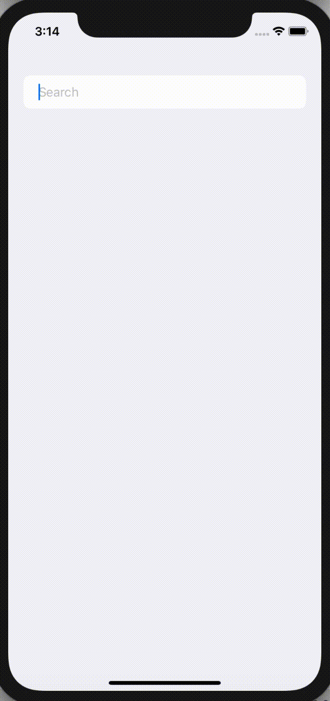

# AutocompleteView

`AutocompleteView` is a SwiftUI view that provides automatic completions as a user types in text field.



It's built on SwiftUI, and the codebase is pretty small so you can quickly go through and learn how it works. Since it's so small, it's not extremely flexible or fast.

#### How you would use it off-the-shelf
I assume you have some class with an array of strings that you want the autocomplete to run on, and a corresponding array of objects that you want each string to be associated to. Conform this class to `ContentProvider`. Then getting the autocompletion view is as easy as:
```swift
import AutocompleteView

struct ContentView: View {
    @State var yourClass: ContentProvider
    var body: some View {
        AutocompleteView.AutcompleteView(suggester: yourClass.makeSuggester())
    }
}
```
This class by itself doesn't actually do anything yet; clicking on an element won't do anything. However, you can pass in two parameters to `AutocompleteView`:
* `destinationView` is a closure that takes the associated object with the autocompletion string and returns the view. This parameter will make it so that if you click on an autocompletion result, it will take you to the destination page.
* `closure` is a closure that takes the associated object with the autocompletion string. It will just run when a user clicks on the autocompletion result.

#### Where to start if you want to modify it
The way it works is you have a `ContentProvider` which has an array of strings. Then this `ContentProvider` makes a `Suggester`. This suggester is an observable object, and has a `prompt` variable where the text field is bound to and it publishes an array of `Suggestion` objects. As the prompt gets changed by the user, the suggestions are recalculated. \
The `SuggestionView` view shows visualizes a single `Suggestion` and the `SuggestionListView` view observes the `Suggester` object and has a list of `SuggestionView`s.\
I've provided an example of how to use it in the "Example" directory with some dog breeds.\
I would suggest looking through the source code in that order ^.

#### Meta
Pull requests are welcome! Possible extensions could be implementing a cache, making it more generic, anything. Also feel free to contact me or drop an issue if you have any questions.
